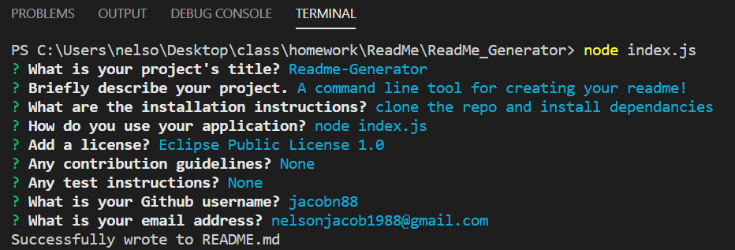

  
  # Readme-Generator
  
  ## Description:
  A command line tool for creating your readme!
  
  ## Table of Contents
  
  - [Installation](#installation)
  - [Usage](#usage)
  - [License](#license)
  - [Contributing](#contributing)
  - [Tests](#tests)
  - [Questions](#questions) 

  ## Installation
  Clone the repo and install dependancies
  ## Usage
  Video:
  https://drive.google.com/file/d/1-xpf2ngGaMWahbPbT_PX0HqKlx8UX_LV/view
  
  ## License
  Uses Eclipse Public License 1.0.
  ## Contributing Guidelines
  None
  ## Tests
  None
  ## Questions
  My Github: https://github.com/jacobn88.
  Reach out to me at nelsonjacob1988@gmail.com with any questions!
 
